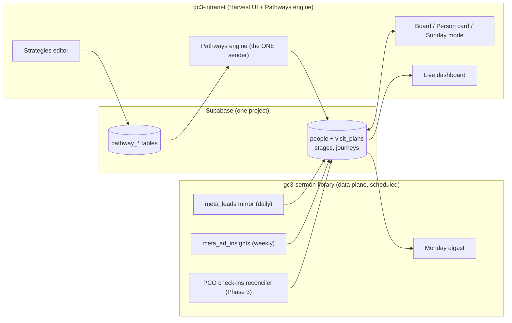

# Harvest: the GC3 lead tracker

*A plan for the build PD asked for: "the ultimate lead tracker." Working name
Harvest, from Luke 10:2, because the whole product exists for the gap between
"the harvest is plentiful" and "the workers are few." Rename at will.*

*Status: plan only. The data plane it stands on (lead mirror, ads scoreboard,
attribution tables) is built or in PR #8; the app itself is not started.*

## What it is

A replacement for the ChurchFunnels UI, built into the house's own intranet:
the drag-and-drop leads board the team already likes, wrapped around the thing
ChurchFunnels can never have, **the whole person**. ChurchFunnels sees a form
fill. The house's database sees the ad that found them, the form they filled,
every email the Pathways engine sent and whether they opened it, the Sunday
they sat in a seat, their Growth Track steps, all of it, because it is all
already in one Supabase project.

Ground rules, from experience:

- **UI first, mobile first.** Staff live on phones. Every screen designs for
  a thumb before a mouse.
- **ChurchFunnels stays on until Harvest reaches parity.** No gap like
  October 2025 ever again. The lead mirror feeds both during the transition.
- **Harvest never sends member email itself.** Its automations orchestrate
  the Pathways engine, which already has the on and off switch, the shared
  suppression list, unsubscribe links, and the admin page. The 2026-08-05
  lesson is structural: one sender in the house, ever.
- **Giving data stays off lead cards entirely.** A guest's card shows their
  journey, never their money. God does the seeing.

## The unfair advantage (why build instead of rent)

One Supabase project already holds, or will after PR #8:

| Data | Table(s) | What the card shows with it |
|---|---|---|
| Which ad found them | `meta_leads` (ad, campaign, form) | "Came through PYV 2026, Reel #3" |
| Ad performance | `meta_ad_insights` | cost per person in this stage |
| What the house sent them | `pathway_sends`, `email_clicks` | "Opened Saturday reminder" |
| Whether they came | PCO Check-Ins (Phase 3 read) | "Attended Aug 10, kids checked in" |
| What they did next | `gt_profiles`, `gt_progress` | "Started GATHER" |
| Funnel history | `ghl_baseline_monthly`, opportunities import | two years of context |

Renting GoHighLevel means paying monthly to look at one slice of this through
a clunky window. Building means the church's own roles, the church's own
language, and every slice on one card.

## The product, screen by screen

**1. The Board.** Columns are stages (Planned a Visit, Confirmed, Attended,
No Show, Not Coming, Returned), same mental model the team already has from
ChurchFunnels, so there is nothing to relearn. Cards carry name, the Sunday
they planned, a source chip (which campaign), days in stage, and three
one-tap actions: call, text, note. Web: drag cards between columns. Phone:
one column at a time, swipe between stages, long-press to move a card via a
bottom sheet. Filters in one row: This Sunday, campaign, assigned to, gone
quiet. Realtime: two staffers see each other's moves live (Supabase
realtime).

**2. The Person card.** Tap a card, get the journey, newest first: ad click,
form fill, each Pathway email with opened or clicked, personal touches
logged (a "texted them" button that takes two seconds on a phone), attended
Sundays, Growth Track milestones. Plus notes and assignment. This is the
"ultimate" part and it is mostly a query, because the data is already home.

**3. Sunday mode.** A greeter-friendly list of everyone expected today, big
photo-less cards, one giant button: They Are Here. Marks attended, moves the
card, feeds the scoreboard. Later the same list reconciles against PCO
Check-Ins automatically, so even unmarked attends get caught by the nightly
job. This screen is how 4.3% recorded attendance becomes a real number.

**4. Strategies.** The Church Candy playbook as editable sequences, run
through Pathways. Ships with three templates:
- *Plan My Visit*: instant confirm, Saturday reminder, Sunday morning text
  task for a human, after-visit thank you, no-show warm re-invite, day-7
  last touch.
- *Event follow-up* (the FIRE CONFERENCE kind): confirm, event reminder,
  after-event bridge to a Sunday.
- *No-show revival*: the 1,031-person warm list, gentle, spaced, capped.
Each step is a card in a vertical sequence: toggle it, edit its copy (house
style enforced: 60 to 90 words, Scripture after the point, the P.S. carries
the ask), change its wait. Version one is this sequence editor, which covers
everything Church Candy actually did. Version two is the full drag-and-drop
canvas (triggers, branches, conditions as nodes) once the sequences prove
out; building the canvas first is how products spend six months shipping
nothing.

**5. The Dashboard.** The Ads to Seats page, live: spend to leads to arrived
to seated to returned, per campaign, against the two-year baseline. The
artifact built on 2026-08-12 is the prototype; here it reads the tables
directly and updates itself.

**6. Tasks.** The personal-touch queue: who needs a text from PD today, who
a greeter should watch for, what fell out of a strategy for a human to
catch. Assignable, phone-first, tap-to-call.

## Where it lives and how it is built

- **App:** a section of gc3-intranet (Next.js), because auth, roles
  (`roles`, `user_roles`), profiles, and the Pathways engine already live
  there. Harvest is routes and components, not a new deployment.
- **Drag and drop:** dnd-kit for the board (small, accessible, touch-solid).
  React Flow for the version-two canvas.
- **Realtime:** Supabase realtime on the cards table.
- **Roles:** staff see the board; greeters see Sunday mode only; giving data
  appears nowhere in Harvest.
- **This repo stays the data plane:** mirrors, scoreboard, reconciler,
  digest. No UI here, no email to members here, same as always.

## Data model additions (sketch)

- `people`: the unification spine. One row per human, matched across
  `meta_leads` (email and phone), PCO person id, `gt_profiles`, ChurchFunnels
  contact id. Created by the ingest path and a nightly reconciler in this
  repo; merge tool in the UI for the inevitable duplicates.
- `visit_plans` (from the Visit Module plan): becomes the card table, gains
  `stage`, `assigned_to`, `stage_changed_at`.
- `lt_stage_events`: every stage move, who and when, so the funnel math and
  the audit trail are free.
- `lt_touches`: logged human touches (called, texted, met), two-tap entry.
- `strategy_*`: strategies and steps, compiled into `pathway_rules` and new
  pathway sequences so the Pathways engine executes everything member-facing.

## Phases (each one ships something the team uses)

**Phase A, see everything (fast):** the `people` spine, the Board and Person
card read-only over existing data (mirror, opportunities import, pathway
sends), plus the live dashboard route. No writes yet: the team looks at
Harvest next to ChurchFunnels and feels the difference.

**Phase B, work the board:** drag to move stages, notes, touches, tasks,
Sunday mode with the big button. ChurchFunnels becomes the backup nobody
opens.

**Phase C, strategies:** the sequence editor compiling to Pathways, the
three templates live, the no-show revival run as its first campaign (with
PD's copy approval, per house style).

**Phase D, the canvas and the extras:** React Flow drag-and-drop workflow
builder, SMS steps (A2P registration and consent, a deliberate decision),
PCO auto-reconcile if not already landed, ManyChat front door if wanted.

**Cutover:** when B is stable and C covers the active sequences, export the
final ChurchFunnels state, import, point the lead mirror's downstream at
Harvest alone, and the subscription ends. Not before.

## What this needs decided (PD)

1. A yes to the shape, and a name (Harvest is a placeholder with a verse
   behind it).
2. Who the users are for Phase A (PD plus who else, and what a greeter may
   see).
3. Attach the gc3-intranet repository to a working session so Phase A can
   start; that is where the app must be built.
4. Copy approval checkpoints for Phase C sequences (house style review).

## What deliberately does not change

Creative Church Marketing keeps running ads into the same instant forms. The
mirror keeps catching every lead daily. The Monday digest keeps arriving.
ChurchFunnels keeps working the whole time. Harvest replaces the window, not
the plumbing, and the plumbing is already the house's.
