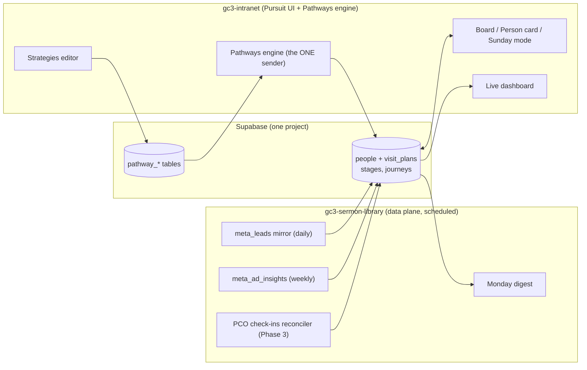

# Pursuit: the GC3 lead tracker

> **Pursuit is a status board for every person God sends,
> guiding each gift through their journey with God and with GodChasers.**
>
> **God pursues the ONE. We are stewards of the ninety-nine.**
>
> **Pursuit is our tool.**

*PD's creed, and the sentence every screen answers to. Cornerstone verse,
Philippians 3:12: "I press on to take hold of that for which Christ Jesus
took hold of me." The kanban screen inside it is the Board; in hallway
speech, the Pursuit Board.*

*Status: plan only. The data plane it stands on (lead mirror, ads scoreboard,
attribution tables) is built or in PR #8; the app itself is not started.*

## What it is

A replacement for the ChurchFunnels UI, built into the house's own intranet:
the drag-and-drop leads board the team already likes, wrapped around the thing
ChurchFunnels can never have, **the whole person**. ChurchFunnels sees a form
fill. The house's database sees the ad that found them, the form they filled,
every email the Pathways engine sent and whether they opened it, the Sunday
they sat in a seat, their Growth Track steps, all of it, because it is all
already in one Supabase project.

Ground rules, from experience:

- **UI first, mobile first.** Staff live on phones. Every screen designs for
  a thumb before a mouse.
- **ChurchFunnels stays on until Pursuit reaches parity.** No gap like
  October 2025 ever again. The lead mirror feeds both during the transition.
- **Pursuit never sends member email itself.** Its automations orchestrate
  the Pathways engine, which already has the on and off switch, the shared
  suppression list, unsubscribe links, and the admin page. The 2026-08-05
  lesson is structural: one sender in the house, ever.
- **Giving data stays off lead cards entirely.** A guest's card shows their
  journey, never their money. God does the seeing.

## The spine: five ships, one fleet

The journey Pursuit tracks, named the way PD will preach it. Everyone is on
a ship; the house's job is to help them board the next one. Worship is not a
stage; it is the water the whole fleet sails on.

| Ship | Who is aboard | Boarding marker (data) | Automation posture |
|---|---|---|---|
| **Friendship** | Known to the house, not yet in Planning Center: the ad, the DM, the PMV form, the invited coworker | lead captured, and no PCO record yet | Heaviest: confirmations, reminders, re-invites. The machine's home turf. |
| **Fellowship** | Everybody the house has entered: visitors, first-time guests, givers under the Partnership bar | **has a Planning Center record.** See docs/pursuit-ship-rules.md | Light: after-visit thank you, a return nudge, then hands off to humans. |
| **Partnership** | Planted and committed to the house | Growth Track complete, covenant step taken, serving team joined. **Never a giving marker: a partner who gives quietly is seen by God, not by the software.** | Celebration sends only; enrollment into Discipleship invitations. |
| **Discipleship** | Being formed | Charisma Track, mentoring, serving consistently | Minimal: scheduling help and human tasks. Formation is hand to hand. |
| **Leadership** | Reproducing | Leader Track, leading a team or group | None toward the person; the system instead helps them start new Friendships. |

The fleet loops: Leadership's assignment is new Friendships, which turns the
journey from a pipe into an engine. People board at any ship (a transfer
member enters at Partnership without ever seeing an ad), stall without
falling off the map, and are never automated backward. The operational
sub-stages below (Planned a Visit, Attended, No Show) live inside Friendship
and Fellowship: the congregation hears ships, the staff screens keep the
precision. Philippians 1:5 anchors the third ship: "your partnership in the
gospel from the first day until now."

The design rule across the fleet: **the machine walks people to the door;
people walk people into the family.** Automation is dense at Friendship and
thins to nothing by Leadership.

### Three languages, one system

The fleet is one of three layers, each speaking to a different audience, and
the discipline is that each stays with its audience:

- **Ships** say where a person is. Congregation language; the only layer
  that gets preached.
- **Attract, Attach, Align, Adore** say what the house does to move people:
  Attract fills Friendship, Attach builds Fellowship, Align forges
  Partnership, and Adore is the deep water that carries Discipleship and
  Leadership. Staff language; each verb names a strategy playbook in
  Pursuit.
- **Attendance, Attention, Agreement, Allegiance** are the observable
  signals that someone may be ready for the next ship: they show up, they
  lean in, they buy the vision, they give their life to it. The software's
  language: Pursuit reads them from attendance records, opens and clicks,
  Growth Track enrollment, and serving commitment, and surfaces "may be
  ready" prompts to a human. Signals suggest; people invite.

### The instrument panel: seven vital signs

Church-level health on the leadership dashboard, distinct from any person's
card. Nearly every sign already has a source in the one database:

| Vital sign | Source | Status |
|---|---|---|
| 1. Online attendance | live-stream poller and "I'm here" taps (intranet), YouTube | partially flowing |
| 2. In-person attendance | PCO Check-Ins, Sunday mode | lands with the PCO loop |
| 3. Financial engagement | `giving_gifts`, **aggregate only**: totals, giver counts, recurring share. Never person-level in Pursuit. | flowing now |
| 4. Reach strategy | ads scoreboard (`meta_ad_insights`, `meta_leads`) | flowing now |
| 5. Discipleship strategy | `gt_*`, future tracks, fleet movement | flowing now |
| 6. Volunteer engagement | `pco_serving` | flowing now |
| 7. Next step engagement | `pathway_sends`, `email_clicks`, Pursuit stage moves | flowing now |

Five of seven are measurable today; the dashboard's job is to put them on
one screen with trend lines and let the Monday digest flag whichever sign
moved most.

## The unfair advantage (why build instead of rent)

One Supabase project already holds, or will after PR #8:

| Data | Table(s) | What the card shows with it |
|---|---|---|
| Which ad found them | `meta_leads` (ad, campaign, form) | "Came through PYV 2026, Reel #3" |
| Ad performance | `meta_ad_insights` | cost per person in this stage |
| What the house sent them | `pathway_sends`, `email_clicks` | "Opened Saturday reminder" |
| Whether they came | PCO Check-Ins (Phase 3 read) | "Attended Aug 10, kids checked in" |
| What they did next | `gt_profiles`, `gt_progress` | "Started GATHER" |
| Funnel history | `ghl_baseline_monthly`, opportunities import | two years of context |

Renting GoHighLevel means paying monthly to look at one slice of this through
a clunky window. Building means the church's own roles, the church's own
language, and every slice on one card.

## The map: every section, every tool

Fifteen rooms in four wings, plus the tools that follow you everywhere. Every
room exists to serve the creed; anything that does not is out.

### Daily wing (where the team lives)

**1. Home (My Day).** Role-aware landing: my tasks, my people, what needs me
today. A greeter, a captain, and PD each open a different Home.

**2. The Board.** The kanban: drag cards through stages on desktop, swipe
and move on phones, realtime between staffers. Saved views (smart lists),
filters in one row (This Sunday, campaign, ship, assigned, gone quiet),
bulk actions, global search.

**3. People.** The directory: every person God has sent, searchable. Each
opens the Person Card: the journey timeline (ad, form, sends, opens,
Sundays, Growth Track, workflow cards), ships history, notes, touches,
tags, assignment, and a merge tool for duplicates.

**4. Sunday.** Service-day mode: everyone expected today, one giant They
Are Here button, a ten-second quick-add for walk-ins (most of the 36 FTGs
came through no funnel; Sunday captures them), and instant follow-up
assignment. Feeds attendance to the vital signs live.

**5. Tasks.** Everything assigned to me across boards, strategies, and
workflows: the personal-touch queue, due dates, snooze, done. Tap to call
or text from the task.

### Fleet wing (a workspace per ship)

**6 to 10. The five ship rooms.** Every ship gets its own room with the
same four walls:

- **The goal.** A target PD sets per season, tracked live
  (`ship_goals`): Friendship, planned visits per month and first touch
  under one hour; Fellowship, show rate and second-visit rate;
  Partnership, Growth Track completions and covenant steps; Discipleship,
  track enrollment and serving rate; Leadership, leaders commissioned and
  new Friendships started by leaders.
- **The cards.** That ship's slice of the Board.
- **The plays.** The strategies and workflows that serve this ship.
- **The crew.** Its captain and team, with each person's queue.

A captain opens their ship room and sees their whole charge on one screen:
the goal, the gap, the people, the plays, the crew.

### Engine wing (how work gets done)

**11. Strategies.** Member-facing sequences, compiled to the Pathways
engine (the one sender): the sequence editor, the template library (Plan
My Visit, event follow-up, no-show revival), house-style copy editing
(60 to 90 words, Scripture after the point, the P.S. carries the ask),
test mode, and per-strategy results (sent, opened, clicked, moved ships).
The drag-and-drop canvas builder arrives in Phase D.

**12. Workflows.** Staff task pipelines: baptism prep, volunteer
onboarding, weddings, anything with steps, owners, and due dates. This
room mirrors Planning Center Workflows first, becomes native second, and
replaces them at cutover. Distinct from Strategies on purpose: Workflows
move staff, Strategies move members.

**13. Reach.** The ads room: campaigns, cost per lead, per-ad cost per
seat, form health (the leak monitor that would have caught January), and
the agency scoreboard Creative Church Marketing answers to.

### Leadership wing

**14. Vital Signs.** The seven signs with trends, the fleet view (aboard
each ship, moved up this month), and Ads to Seats live. The Monday digest
quotes it.

**15. Admin.** Roles and permissions, stage and ship configuration, goal
setting, integration health (Meta, PCO, Pathways, ChurchFunnels during
transition), the audit log, and suppression visibility read from the
Pathways engine.

### Tools that follow you everywhere

Global search from any screen. Quick-log a touch (called, texted, met) in
two taps. Click to call or text. Notes with mentions. Per-person activity
feed. CSV import and export. Push notifications for my assignments and my
people's milestones.

### Who sees what

| Role | Their Pursuit |
|---|---|
| Lead Pastor | Everything; Home opens on Vital Signs and the personal-touch queue |
| Staff admin | All boards, People, Workflows, Admin |
| Ship captain | Their ship room, its board slice, plays, and crew queues |
| Ministry leader | Their workflow pipelines and their team's tasks |
| Greeter | Sunday mode only |
| Everyone | Only what their role needs; giving aggregates appear on Vital Signs for leadership only, and never on any card |

## Where it lives and how it is built

- **App:** a section of gc3-intranet (Next.js), because auth, roles
  (`roles`, `user_roles`), profiles, and the Pathways engine already live
  there. Pursuit is routes and components, not a new deployment.
- **Drag and drop:** dnd-kit for the board (small, accessible, touch-solid).
  React Flow for the version-two canvas.
- **Realtime:** Supabase realtime on the cards table.
- **Roles:** staff see the board; greeters see Sunday mode only; giving data
  appears nowhere in Pursuit.
- **This repo stays the data plane:** mirrors, scoreboard, reconciler,
  digest. No UI here, no email to members here, same as always.

## Data model additions (sketch)

- `people`: the unification spine. One row per human, matched across
  `meta_leads` (email and phone), PCO person id, `gt_profiles`, ChurchFunnels
  contact id. Created by the ingest path and a nightly reconciler in this
  repo; merge tool in the UI for the inevitable duplicates.
- `visit_plans` (from the Visit Module plan): becomes the card table, gains
  `stage`, `assigned_to`, `stage_changed_at`.
- `lt_stage_events`: every stage move, who and when, so the funnel math and
  the audit trail are free.
- `lt_touches`: logged human touches (called, texted, met), two-tap entry.
- `strategy_*`: strategies and steps, compiled into `pathway_rules` and new
  pathway sequences so the Pathways engine executes everything member-facing.
- `pco_workflows`, `pco_workflow_cards`: Planning Center Workflows mirrored
  in (definitions, steps, live cards, assignees), synced by a scheduled job
  on the existing PCO credentials.

### Planning Center workflows: mirror, then replace

PD's call: Pursuit ultimately replaces PCO Workflows. The path there in
three steps, with one boundary:

- **Mirror from day one.** PCO workflow cards appear on the Pursuit person
  card ("Baptism Prep, step 2 of 5, assigned to LaTwanna"), so staff never
  wonder what the other system is doing while both exist.
- **Rebuild natively.** The chase workflows (visitor, assimilation) become
  Pursuit stages and strategies early; the operational pipelines (baptism
  prep, volunteer onboarding, weddings) become native Pursuit Workflows in
  Phase D, imported from their PCO definitions.
- **Retire.** When native Workflows carry every live process, PCO Workflows
  are turned off. One home per process the whole way through; nothing runs
  in two places.

The boundary: Pursuit replaces PCO **Workflows** only. PCO **People** stays
the membership record and PCO **Check-Ins** stays the attendance source;
Pursuit reads both and replaces neither. Replacing kiosk check-in hardware
is nobody's calling.

## Phases (each one ships something the team uses)

**Phase A, see everything (fast):** the `people` spine, the Board and Person
card read-only over existing data (mirror, opportunities import, pathway
sends, PCO workflow cards), plus the live dashboard route. No writes yet: the team looks at
Pursuit next to ChurchFunnels and feels the difference.

**Phase B, work the board:** drag to move stages, notes, touches, tasks,
Sunday mode with the big button. ChurchFunnels becomes the backup nobody
opens.

**Phase C, strategies:** the sequence editor compiling to Pathways, the
three templates live, the no-show revival run as its first campaign (with
PD's copy approval, per house style), and PCO workflow cards as a strategy
action so assimilation steps land on the right staffer's PCO list.

**Phase D, the canvas and the extras:** native Workflows imported from PCO
definitions (and PCO Workflows retired once they carry every live process),
ship goals and captain rooms, plus the React Flow drag-and-drop workflow
builder, SMS steps (A2P registration and consent, a deliberate decision),
PCO auto-reconcile if not already landed, ManyChat front door if wanted.

**Cutover:** when B is stable and C covers the active sequences, export the
final ChurchFunnels state, import, point the lead mirror's downstream at
Pursuit alone, and the subscription ends. Not before.

## What this needs decided (PD)

1. A yes to the shape. The name is settled: Pursuit.
2. Who the users are for Phase A (PD plus who else, and what a greeter may
   see).
3. Attach the gc3-intranet repository to a working session so Phase A can
   start; that is where the app must be built.
4. Copy approval checkpoints for Phase C sequences (house style review).

## What deliberately does not change

Creative Church Marketing keeps running ads into the same instant forms. The
mirror keeps catching every lead daily. The Monday digest keeps arriving.
ChurchFunnels keeps working the whole time. Pursuit replaces the window, not
the plumbing, and the plumbing is already the house's.
