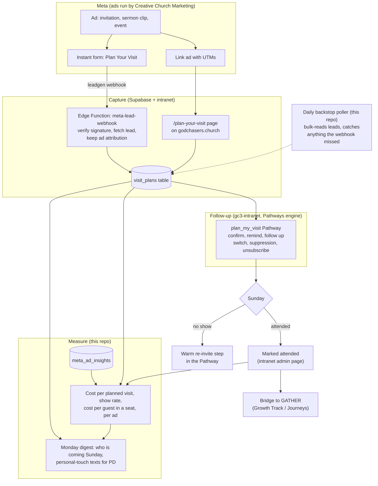

# GC3 Visit Module: owning the plan-a-visit funnel

*A plan, not code. Nothing in this document is built yet. It maps what we are
building, where each piece lives, and in what order.*

## Why this exists

With Church Candy, the ads produced butts in seats because of what sat behind
them: a Plan Your Visit form on Facebook, and an automated follow-up sequence
(confirmation, reminders, nudges before Sunday) running in their ChurchFunnels
software. The research confirms what ChurchFunnels actually was: a
white-labeled GoHighLevel CRM. We were renting the funnel. The leads, the
sequences, and the conversation history lived in an agency's instance, and
when we left, the pipeline did not come with us.

Creative Church Marketing (the new agency, Greenville SC, 300+ churches) will
run the ads. Good: that is a skill worth paying for. But the funnel behind
the ads, the thing that turns a form fill into a person in a seat, should be
ours. We already own every piece needed to build it: one Supabase project,
the Pathways engine in gc3-intranet with its switch and suppression list and
unsubscribe, the Growth Track (Journeys), and this repo's Monday digest and
Meta ads performance report.

**The principle: agencies rent us reach. The funnel, the data, and the
relationship are the house's, permanently, whoever runs the ads.**

## What the Church Candy model actually did (deconstructed)

1. Personalized invitation ads, targeted a few miles around the building,
   aimed at people looking for a church home.
2. A low-friction "Plan Your Visit" form, filled right there on Facebook
   (Meta instant form: name, contact, service date, prefilled by Meta).
3. An immediate, automated follow-up sequence: confirmation on submit,
   reminders and helpful nudges leading up to Sunday.
4. Retargeting: warm audiences built from people who watched video content.
5. Benchmarks from the industry: roughly $3 to $20 cost per lead; churches
   spending $500 to $1,000 a month typically see 30 to 90 planned visits a
   month, converting to 20 to 50 first-time guests.

Nothing in that list requires their software. Every piece maps onto
infrastructure we already run.

## The map



## The data model

One new table, `visit_plans`, in the same Supabase project. Sketch, to be
finalized when Phase 1 is built:

```sql
create table visit_plans (
  id uuid primary key default gen_random_uuid(),
  -- who
  first_name text, last_name text, email text, phone text,
  party_notes text,                    -- "coming with 2 kids", etc.
  -- what they planned
  planned_for date,                    -- the Sunday they picked
  -- where they came from (the attribution that makes ads measurable)
  source text not null,                -- meta_form | landing_page | manual
  leadgen_id text unique,              -- Meta's lead id, dedupe key for forms
  ad_id text, adset_id text, campaign_id text,
  utm_source text, utm_medium text, utm_campaign text, utm_content text,
  -- consent, captured at the form
  email_consent boolean not null default false,
  sms_consent boolean not null default false,
  -- lifecycle
  status text not null default 'planned',
     -- planned -> confirmed -> attended | no_show -> returned
  attended_on date,
  notes text,
  created_at timestamptz not null default now()
);
```

`ad_id` joins to `meta_ad_insights` (already being collected weekly). That
join is the whole reason to build this ourselves: it produces the number no
agency report shows, **dollars per person actually in a seat, per ad**.

## What lives where (the house rules, applied)

| Piece | Lives in | Why |
|---|---|---|
| Ads, creative, targeting | Creative Church Marketing, in OUR ad account | Their craft, our account. Partner access, revocable. |
| Lead webhook + `visit_plans` | Supabase (Edge Function + table) | Needs a real-time endpoint; this repo is scheduled jobs only. |
| Landing page `/plan-your-visit` | gc3-intranet | It is a public page of the house's site. |
| Confirmation, reminders, follow-up | **Pathways engine in gc3-intranet** | It is email to a person. The switch, suppression list, unsubscribe, and admin page live there. Nothing in this repo sends to a member, and a visitor is no exception. |
| Backstop lead poller, ads-to-visits join, digest section | This repo | Scheduled, read-and-report, emails only PD. Its lane. |
| PD's personal text to each planner | A human | The digest prompts it. Not automated, on purpose. |

The follow-up sequence is exactly the kind of thing that once got rebuilt in
this repo as a second emailing system. It will not be again: the
`plan_my_visit` sequence is a Pathway, switchable at `/admin/pathways`,
honoring the shared suppression list, carrying a real unsubscribe.

## The follow-up sequence (drafted for the Pathway, house style)

Best practice from the research: confirm instantly, remind before Sunday,
follow up the same day after, route any reply to a human and stop the
sequence when a human takes over.

| Step | When | Channel | Content sketch |
|---|---|---|---|
| Confirm | minutes after the form | email (Pathway) | You are expected. Service time, address, parking, what kids experience looks like. P.S.: reply and tell us who is coming. |
| Personal touch | same day | text from PD | Prompted by the digest with name and number. Human, not automated. |
| Reminder | Saturday | email (Pathway) | Short. See you tomorrow. One practical detail. |
| After the visit | Sunday afternoon | email (Pathway) | Thank you for coming. No ask in the body. P.S. carries the next step (GATHER). |
| No-show | Tuesday | email (Pathway) | Warm, zero guilt. Sundays happen weekly; pick another one. |
| Re-invite | day 6 or 7 | email (Pathway) | Last automated touch. Then the sequence ends. |

Every word in house style: 60 to 90 words, Scripture after the point, God
does the seeing (never "I noticed you signed up"), the body asks for
nothing, the P.S. carries the next step.

Automated texting (what made ChurchFunnels feel responsive) is deliberately
NOT in v1. It needs A2P 10DLC registration, TCPA-grade consent capture, and
a reply-routing plan; and PD's genuinely personal text is worth more than an
automated one. It is Phase 4, a decision, not a default.

## Phases

**Phase 0: own the accounts (do this now, before building anything)**
- Confirm the ad account, the Facebook Page, and the pixel/dataset sit in
  OUR Business Manager. Creative Church Marketing gets partner access,
  revocable, never ownership.
- **Export the lead and contact history from ChurchFunnels before the old
  account closes.** That list is people who once raised a hand. Once the
  GoHighLevel instance is gone, it is gone.
- Create the Meta app for webhooks; grant it lead access in Leads Access
  Manager (Meta restricts lead downloads per app and person; this bites
  everyone the first time).

**Phase 1: capture, and own the data**
- `visit_plans` table (schema above).
- Supabase Edge Function `meta-lead-webhook`: verify `X-Hub-Signature-256`,
  fetch the full lead by `leadgen_id` (needs `leads_retrieval` +
  `pages_manage_ads` on a Page token from a System User, so it never
  expires), insert with ad attribution.
- `/plan-your-visit` landing page in gc3-intranet writing to the same table
  with UTMs, so link ads and the website funnel share one pipeline.
- Daily backstop poller in this repo: bulk-read recent leads, upsert
  anything the webhook missed (webhooks fail quietly; the poller is the
  net). Report-only otherwise.
- Digest gains: "Visits planned this week, and which ad produced each."

**Phase 2: the follow-up Pathway (gc3-intranet)**
- `plan_my_visit` Pathway enrolling off `visit_plans`, sequence above,
  switchable, suppressed, unsubscribable. Off until PD flips it on.

**Phase 3: close the loop**
- Attendance marking: a small intranet admin list of this Sunday's expected
  guests; whoever greets checks them off (or PD does Monday from the
  digest).
- Reporting in this repo: join `visit_plans` to `meta_ad_insights`. The
  digest and the ads report gain cost per planned visit, show rate, and
  cost per attended guest, per ad and per campaign. This is the scoreboard
  Creative Church Marketing gets held to.
- Bridge to Journeys: an attended guest surfaces as a GATHER candidate.

**Phase 4: optional accelerators, each a deliberate PD decision**
- Automated SMS reminders (A2P 10DLC, express consent checkbox on the form,
  replies routed to a person).
- Conversions API: send "attended" back to Meta as an offline event (hashed,
  only for people who came through an ad) so Meta optimizes for people who
  actually show up, not people who fill forms. This is different in kind
  from uploading house lists, but it is still member data leaving the
  house, so it ships only if PD says so.
- Lookalike seed audiences: same rule. Hand-approved list or not at all.

## The scoreboard (what we will finally be able to see)

| Stage | Metric | Today | After Phase 3 |
|---|---|---|---|
| Ad seen | impressions, CTR, spend | in `meta_ad_insights` now | same |
| Hand raised | cost per lead | agency reports it | ours, per ad |
| Visit planned | planned visits per week | in ChurchFunnels, lost | `visit_plans` |
| Seat filled | show rate, cost per guest | nobody measured it | **the headline number** |
| Came back | return rate | unknown | `status = returned` |
| Growing | GATHER starts from ads | unknown | joined to `gt_*` |

Industry benchmarks to calibrate against (not targets): $3 to $20 per lead;
30 to 90 planned visits per month at $500 to $1,000 spend; show rates vary
widely, which is exactly why we measure our own.

## Risks and their answers

- **Webhooks miss.** The daily poller in this repo backstops them.
- **Tokens expire.** System User token, same rule as the ads report.
- **Instant-form leads can be low intent** (prefilled forms are easy to
  submit). Counter: one custom question on the form ("Who is coming with
  you?") adds just enough friction, and the show-rate metric will tell us
  whether instant forms or the landing page produce better guests. Run both.
- **Speed to lead.** The webhook is real-time and the Pathway confirms in
  minutes; the digest prompts PD's text the same day.
- **A second emailing system grows here by accident.** It will not: the rule
  stands, the sequence is a Pathway, and this repo's `send_email` still
  refuses every address but PD's.
- **Losing history again.** Everything lands in our Supabase from day one.
  Switching agencies in the future means changing who has partner access to
  the ad account, nothing else.

## What this needs from PD (decisions, not work)

1. Phase 0 account ownership check with Creative Church Marketing, and the
   ChurchFunnels data export, as soon as possible.
2. A yes to the phase order above (or a reorder).
3. Sequence copy approval when Phase 2 drafts it.
4. Phase 4 calls (SMS, Conversions API) when we get there, not before.

## Sources

- [ChurchCandy: church funnels service page](https://churchcandy.com/services/grow-your-church-with-proven-church-funnels/)
- [ChurchCandy: Facebook ads for churches strategy](https://churchcandy.com/facebook-ads-for-churches-your-outreach-strategy/)
- [GoHighLevel case study: ChurchCandy built on white-label HighLevel](https://www.gohighlevel.com/case-study-brady-sticker)
- [Creative Church Marketing](https://creativechurchmarketing.com/)
- [Meta: retrieving leads](https://developers.facebook.com/documentation/ads-commerce/marketing-api/guides/lead-ads/retrieving)
- [Meta: webhooks for lead ads](https://developers.facebook.com/documentation/ads-commerce/marketing-api/guides/lead-ads/quickstart/webhooks-integration)
- [Meta: leadgen webhooks setup](https://developers.facebook.com/docs/graph-api/webhooks/getting-started/webhooks-for-leadgen/)
- [Adrize: Facebook lead ads for churches, benchmarks](https://adrizedigital.com/blog/facebook-lead-ads-for-churches/)
- [Text In Church: guest follow-up timing](https://textinchurch.com/blog-posts/church-guest-follow-up-plan)
- [Vers Creative: first month of church ads expectations](https://www.verscreative.com/post/what-to-expect-from-your-first-month-running-church-ads)
