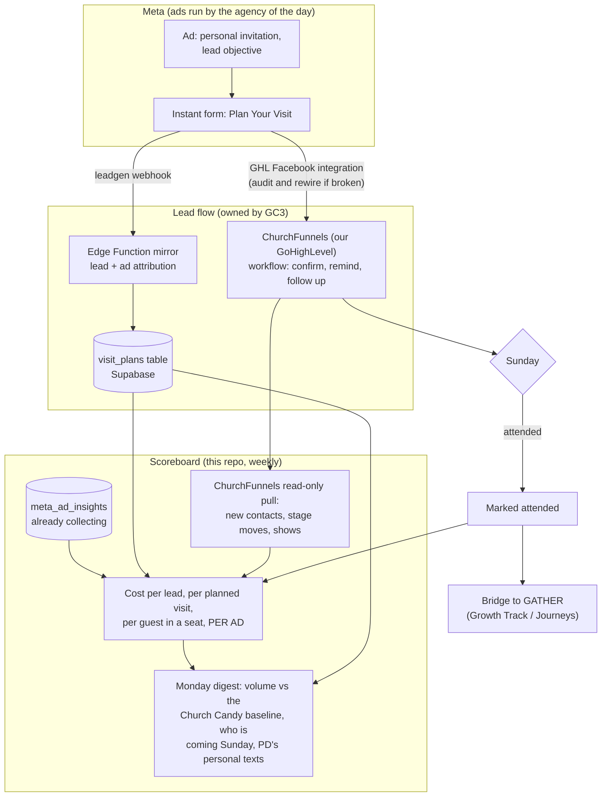

# GC3 Visit Module: filling and owning the funnel

*A plan, not code. Nothing in this document is built yet. It maps what we are
building, where each piece lives, and in what order.*

## The situation, stated plainly

GC3 pays for ChurchFunnels independently. The funnel, its workflows, and
every contact in it are already the house's, and they survived the agency
switch. What did not survive is **volume**: with Church Candy running the
ads, a lot more people were being funneled into it than are arriving now
under Creative Church Marketing.

So this is not a rebuild-the-funnel problem. It is two problems, in order:

1. **Top of funnel: the ads are not filling it the way they used to.**
   Diagnose why, then fix it, whether that means directing the new agency or
   running the plays ourselves.
2. **Ownership of the measurement: nobody on our side can currently see, in
   one place, which ad produced which lead, what each seat cost, and whether
   the new agency is earning its fee.** That layer is what we build, and it
   is agency-proof: it keeps working no matter who runs the ads.

**The principle stands: agencies rent us reach. The funnel, the data, and
the scoreboard are the house's, permanently.**

## Why the volume probably dropped (ranked, from the research)

Church Candy's system, deconstructed: personalized invitation ads built from
the church's own photos and video, targeted a few miles around the building,
pointed at a **Meta instant form** (Plan Your Visit, prefilled by Facebook,
filled without leaving the app), feeding an automated
confirmation-and-reminder sequence in ChurchFunnels, with a retargeting
layer warming everyone who watched the videos. ChurchFunnels itself is a
white-labeled GoHighLevel CRM, and Church Candy built its whole model on
that integration working end to end.

The likely causes of the drop, most probable first:

1. **Objective and form type.** Lead-objective campaigns with instant forms
   produce several times the lead volume of traffic campaigns pointed at a
   landing page. If Creative Church Marketing is running traffic, awareness,
   or engagement objectives, or sending clicks to a page with a form on it,
   volume falls off a cliff even at identical spend.
2. **The Meta-to-ChurchFunnels connection may have broken at handoff.**
   GoHighLevel ingests Facebook leads through a per-location Facebook
   integration tied to a Page and its forms. If Church Candy configured
   that connection through their access, the switch could have severed it:
   leads may be arriving at Meta and never reaching ChurchFunnels at all.
   This one is cheap to check and would be invisible from the ad reports.
3. **Spend and campaign mix.** Same dollars split across more objectives
   (video views, brand awareness) means fewer dollars buying leads.
4. **Creative style.** The personal-invite look (real faces, phone-shot
   video, "we saved you a seat") out-pulls polished brand creative for this
   job.
5. **No retargeting layer.** Cold audiences only, with no warm middle, makes
   every lead a first-touch lead, and first-touch leads cost more.

Industry calibration: $3 to $20 per lead; $500 to $1,000 a month typically
produces 30 to 90 planned visits a month. If current numbers are far off
that, the cause is on the list above.

## Diagnosis before prescriptions (Phase 0, mostly reading data we already own)

1. **The ChurchFunnels contact timeline.** Contacts in GoHighLevel carry
   created-at dates and sources. Chart monthly new contacts from Facebook
   for the last 18 to 24 months and mark the agency transition. That is the
   ground-truth volume curve, and it tells us the size of the gap we are
   closing.
2. **Ad account history.** If Church Candy ran ads in OUR ad account (check
   Business Manager), Meta retains 37 months of insights. A one-time pull
   of monthly campaign-level history, era-tagged, shows exactly what
   changed: objectives, spend, cost per lead, which campaigns used instant
   forms. This is a small script away, using the same API access the weekly
   ads report already needs. If the old ads ran in Church Candy's account,
   we skip this and lean on the ChurchFunnels timeline.
3. **The lead-flow audit.** Submit a test lead through the current ad's
   form. Does it land in ChurchFunnels? In minutes or days? Does it enter
   the workflow? Whose Business Manager owns the Page and the lead forms,
   and does our ChurchFunnels location hold a live Facebook integration?
4. **What is Creative Church Marketing actually running?** The weekly ads
   report built in this repo already answers this from the API: objectives,
   spend, results by type. Its first live run is the audit.

## The map



ChurchFunnels keeps its job: it is paid for, it works, and the staff knows
it. What gets added around it is the attribution mirror (so every lead is
also in our Supabase, stamped with the ad that produced it) and the
scoreboard (so ad spend and seats connect in one weekly view). If the house
ever wants follow-up moved into the Pathways engine in gc3-intranet, that
becomes a clean migration later, because the leads already land in our
table; it is an option in Phase 4, not a prerequisite for anything.

## The data model

One new table, `visit_plans`, in the same Supabase project. Sketch:

```sql
create table visit_plans (
  id uuid primary key default gen_random_uuid(),
  -- who
  first_name text, last_name text, email text, phone text,
  party_notes text,
  -- what they planned
  planned_for date,
  -- where they came from (the attribution that makes ads measurable)
  source text not null,                -- meta_form | landing_page | manual
  leadgen_id text unique,              -- Meta's lead id, dedupe key
  ad_id text, adset_id text, campaign_id text,
  utm_source text, utm_medium text, utm_campaign text, utm_content text,
  -- consent, captured at the form
  email_consent boolean not null default false,
  sms_consent boolean not null default false,
  -- lifecycle
  status text not null default 'planned',
     -- planned -> confirmed -> attended | no_show -> returned
  attended_on date,
  ghl_contact_id text,                 -- the same person in ChurchFunnels
  notes text,
  created_at timestamptz not null default now()
);
```

`ad_id` joins to `meta_ad_insights` (already collecting weekly). That join
produces the number no agency report shows: **dollars per person actually
in a seat, per ad**. `ghl_contact_id` ties the Supabase row to the
ChurchFunnels contact so show-rate data flows back.

## What lives where (the house rules, applied)

| Piece | Lives in | Why |
|---|---|---|
| Ads, creative, targeting | Creative Church Marketing, in OUR ad account | Their craft, our account. Partner access, revocable. |
| Visitor follow-up workflow | ChurchFunnels (our GoHighLevel) | Already paid for, already working. Nothing to rebuild today. |
| Lead mirror + `visit_plans` | Supabase (Edge Function + table) | Real-time endpoint; this repo is scheduled jobs only. |
| Weekly scoreboard, digest, history pulls | This repo | Scheduled, read-and-report, emails only PD. Its lane. |
| PD's personal text to each planner | A human | Prompted by the digest. Not automated, on purpose. |
| Follow-up via Pathways engine | gc3-intranet, **only if migrated later** | If ChurchFunnels is ever dropped, member-facing email goes there and nowhere else. Nothing in this repo sends to a member. |

## Phases

**Phase 0: diagnose (days, not weeks)**
- ChurchFunnels contact timeline: the volume curve, before and after the
  switch.
- Ad account history pull (if the history is in our account): a one-time
  era-comparison script alongside the weekly ads report.
- Lead-flow audit: test lead in, confirm it reaches ChurchFunnels and
  enters the workflow; fix or rewire the GHL Facebook integration if it
  broke at handoff.
- Read Creative Church Marketing's current campaigns from the API (the
  weekly ads report's first live run).

**Phase 1: restore volume (the playbook, run by CCM or by us)**
- Lead objective, instant forms, one custom question for intent.
- Personal-invite creative from real congregation photos and phone video,
  refreshed on the fatigue signals the ads report already flags.
- Tight radius targeting; a retargeting layer on video viewers.
- Budget concentrated on lead campaigns, calibrated against the $3 to $20
  per-lead benchmark and our own baseline from Phase 0.
- Weekly: hold results against the Church Candy baseline in the digest.

**Phase 2: the attribution mirror**
- `visit_plans` table plus the Meta leadgen webhook Edge Function, stamping
  every lead with its ad. ChurchFunnels keeps receiving leads exactly as it
  does today; the mirror is additive.
- Daily backstop poller in this repo (webhooks fail quietly; the poller is
  the net).
- Digest gains: visits planned this week, and which ad produced each.

**Phase 3: close the loop**
- Read-only weekly pull from the GoHighLevel API: new contacts, workflow
  stage movement, show outcomes, joined back to `visit_plans` and
  `meta_ad_insights`.
- The digest and ads report gain cost per planned visit, show rate, and
  cost per attended guest, per ad. This is the scoreboard the agency is
  held to.
- Attended guests surface as GATHER candidates (Journeys).

**Phase 4: options, each a deliberate PD decision, none required**
- Migrate follow-up from ChurchFunnels into a `plan_my_visit` Pathway in
  gc3-intranet (drops a subscription, gains the house switch, suppression
  list, unsubscribe, and house-style copy). The mirror makes this a clean
  cutover whenever it is wanted.
- Automated SMS under our own number (A2P 10DLC, express consent on the
  form, replies routed to a person).
- Conversions API: send "attended" back to Meta, hashed, only for people
  who came through an ad, so Meta optimizes for people who show up rather
  than people who fill forms.
- Lookalike seed audiences: hand-approved list or not at all.

## The scoreboard (what we will finally be able to see)

| Stage | Metric | Today | After Phase 3 |
|---|---|---|---|
| Ad seen | impressions, CTR, spend | in `meta_ad_insights` now | same |
| Hand raised | cost per lead, volume vs baseline | agency reports it | ours, per ad, era-compared |
| Visit planned | planned visits per week | in ChurchFunnels only | mirrored in `visit_plans` |
| Seat filled | show rate, cost per guest | nobody joins it to spend | **the headline number** |
| Came back | return rate | unknown | `status = returned` |
| Growing | GATHER starts from ads | unknown | joined to `gt_*` |

## Risks and their answers

- **The volume gap has more than one cause.** Phase 0 measures each lever
  separately (objective mix, integration health, spend, creative) instead
  of guessing.
- **Webhooks miss.** The daily poller backstops them.
- **Tokens expire.** System User token, same rule as the ads report.
- **Instant-form leads can be low intent.** One custom question adds
  friction; the show-rate metric settles the instant-form versus
  landing-page argument with our own data.
- **A second emailing system grows here by accident.** It will not: the
  rule stands, follow-up lives in ChurchFunnels (or someday the Pathways
  engine), and this repo's `send_email` still refuses every address but
  PD's.
- **Agency churn, again.** After Phase 2, switching agencies means changing
  partner access on the ad account. The leads, the history, and the
  scoreboard do not move.

## What this needs from PD (decisions, not work)

1. Confirm where the Church Candy era ads ran: our ad account or theirs.
   (Business Manager > Ad accounts shows the history.)
2. Confirm ChurchFunnels still receives new Facebook leads today, or say
   the word and the lead-flow audit becomes the first build task.
3. A yes to the phase order, or a reorder.
4. Phase 4 calls (Pathways migration, SMS, Conversions API) when we get
   there, not before.

## Sources

- [ChurchCandy: church funnels service page](https://churchcandy.com/services/grow-your-church-with-proven-church-funnels/)
- [ChurchCandy: Facebook ads for churches strategy](https://churchcandy.com/facebook-ads-for-churches-your-outreach-strategy/)
- [GoHighLevel case study: ChurchCandy built on white-label HighLevel](https://www.gohighlevel.com/case-study-brady-sticker)
- [Creative Church Marketing](https://creativechurchmarketing.com/)
- [Meta: retrieving leads](https://developers.facebook.com/documentation/ads-commerce/marketing-api/guides/lead-ads/retrieving)
- [Meta: webhooks for lead ads](https://developers.facebook.com/documentation/ads-commerce/marketing-api/guides/lead-ads/quickstart/webhooks-integration)
- [Meta: leadgen webhooks setup](https://developers.facebook.com/docs/graph-api/webhooks/getting-started/webhooks-for-leadgen/)
- [Adrize: Facebook lead ads for churches, benchmarks](https://adrizedigital.com/blog/facebook-lead-ads-for-churches/)
- [Text In Church: guest follow-up timing](https://textinchurch.com/blog-posts/church-guest-follow-up-plan)
- [Vers Creative: first month of church ads expectations](https://www.verscreative.com/post/what-to-expect-from-your-first-month-running-church-ads)
